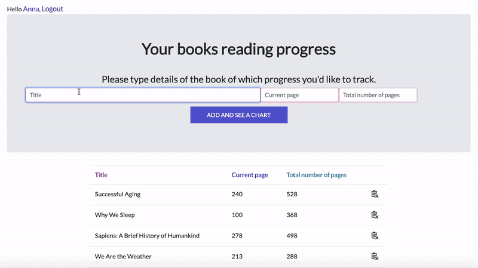

# Reading Tracker App 
#### Django app that helps users with tracking their reading progress and reduce number of unfinished books. 





## Table of contents:
#### * General info
#### * Technologies 
#### * Setup
#### * Testing
#### * Status

## **General info**:
Django-based app with **user authentication system** that contains:
* login, logout
* password change and password reset.
  
Logged in users are allowed to add books entering their titles, total number of pages and current pages. After finish reading some book they can remove its position by clicking on bin icon located to the right of book details.

After adding a first book, a graph showing reading progress appears and it changes dinamically after adding second books.

The **graph displays percentage-wise process** of finishing books, and in that readers are able to see how many books are waiting for finishing and the app can help with making decition *"Which book should I start with?"*

Additionaly, this app was created fot the most part in accordance with **test-driven development** methodology (you will find more information in Testing module). 

## **Technologies**:
* Python 3.8.1
* Django 3.0.2

### Libraries and packages which have been used:
 - **chart.js** (open sourced charts tool based on JavaScript)
 
 ## **Setup**:
In case you would like to clone this repository, please know that my operating system is macOS 10.14.6. 

The app is deployed on [readingtracker.pythonanywhere.com](http://readingtracker.pythonanywhere.com/). Check it out.

 ## **Testing**:

The app has been tested by functional tests and unit tests. **Functional tests** are located in:
```bash
├── project
    ├── functional_tests
```
and they are checking for validation of login, forgotten password process, registration and changing password. Moreover, tests are checking if user cannot add title that already had been added before or cannot add position with empty title and incorrect data format.

**Unit tests** are located in:
```bash
├── project
    ├── app
        ├── tests
            ├── test_views.py
            ├── test_forms.py
            ├── test_models.py
```
that contains 39 unit tests. All tests pass.

## **Status**:
The project is finished. 

 
